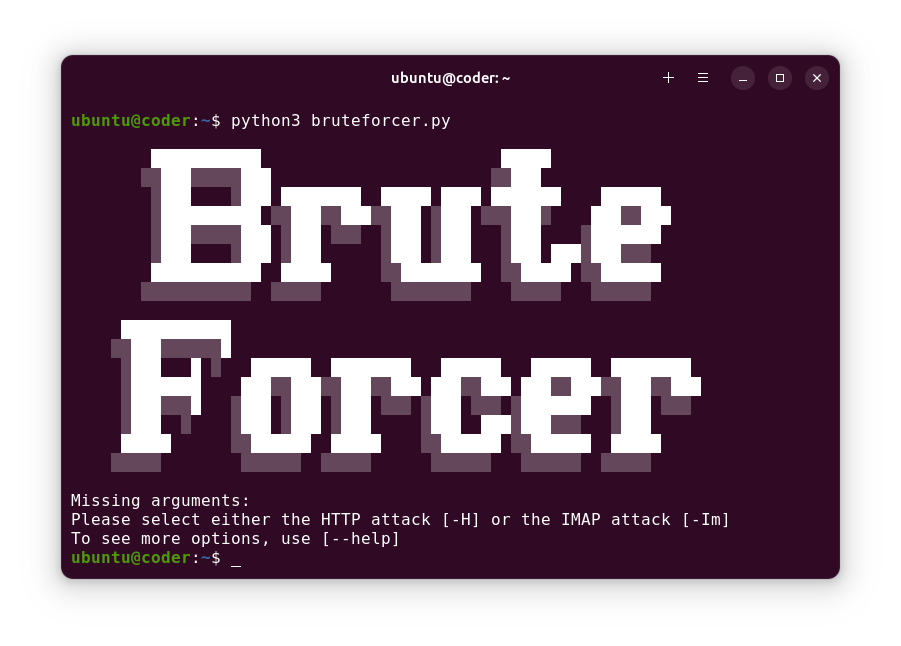

<div align="center">

## Bruteforce Concept Demonstration
[](https://python.org/)

### A demonstration of the concept of bruteforcing a website or email login written in Python.

</div>

### Introduction
This project was assigned as a pet project for work. It is not meant to be used as a practical tool, but as an educational demonstration.

This tries to demonstrate the underlying code behind bruteforce network attacks, both to websites and emails.

### How to Run it
To run the application, simply invoke it with the appropriate flags for it to function. Using the `--help` flag will show a list of the available flags and options. Any missing flags for the code to function will be indicated on the terminal window.
###### Run it with python:
```sh
python3 bruteforcer.py --help
```
###### Or run it directly with a shell:
```sh
./bruteforcer.py --help
```

> ###### Dependencies:
> This project depends on `python3` and the following python libraries: `argparse` `requests` `imaplib`

### How to Use it
The application will execute the actions indicated by the entered flags and then _promptly_ exit. If any other actions are desired, run the program again using different flags.



##
> #### DISCLAIMER: I do not condone the use of this software in any way that breaks the law, as it was made entirely for educational purposes.
> The software is offered as is, and **I do not** take responsibility for any kind of misuse.
##

<div align="center">

[](#bruteforce-concept-demonstration)

</div>
